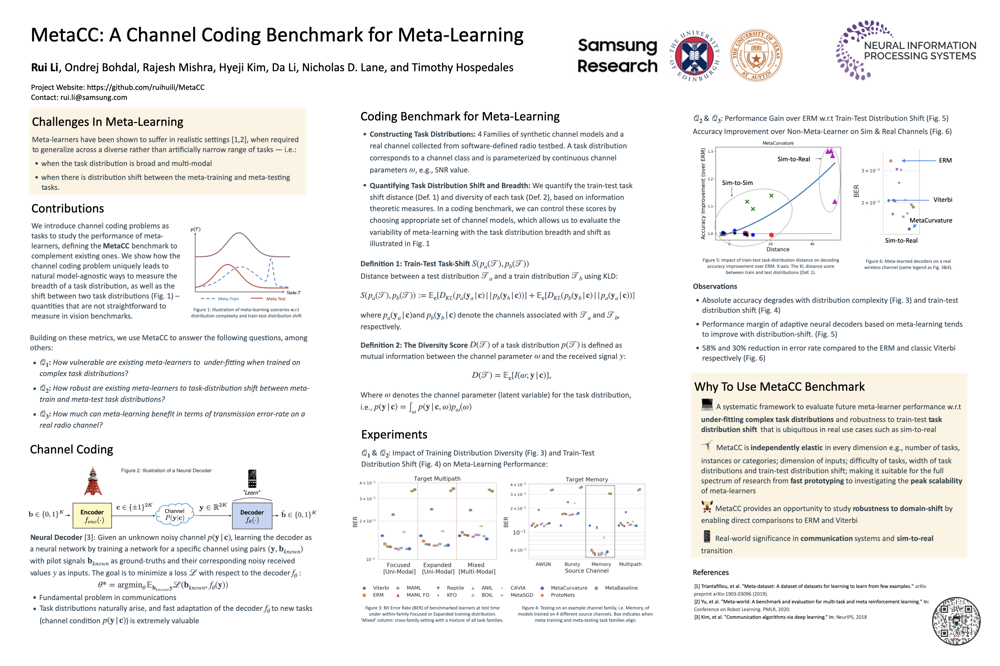

# MetaCC: A Channel Coding Benchmark for Meta-Learning

This repository provides a benchmarking framework for meta-learning using the channel coding tasks, as introduced in our [[Paper](https://arxiv.org/pdf/2107.07579.pdf)] in NeurIPS2021 Benchmarks Track. We build the codebase based upon learn2learn library.  

We currently have implementations of the following algorithms for the channel decoding task:   
- 12 meta-learning algorighms, including: MAML, MAML + FOMAML, Reptile, Meta-SGD, Meta-KFO, ANIL, MetaCurvature, CAVIA, BOIL, ProtoNets, FEAT, and MetaBaseline.  
- 3 non-meta few-shot baselines, including: ERM, SUR-ERM, and SUR-Proto.   
- and 1 non-ML baseline called Viterbi.  

# Data Generation  
We use [[commpy](https://github.com/veeresht/CommPy/blob/master/doc/index.rst)]'s implemention of the convolutional encoder and viterbi decoder. 
The file data_utils/gen_channel_data.py contains functions used for generating true messages, encoding (via API to commpy), and the noise injection to coded bits. 

Currently, we use pre-generated dataset instead of generating data on-the-fly in order to reduce the total training time. The dataset is produced using notebooks/CreateDataset.ipynb. 


## Public Dataset
To reproduce our results or run the code in this repo as is, download our pre-generated [[dataset](https://drive.google.com/drive/folders/1QTTPxyylBJntAru2b_KZ39tNZZMl_WfG?usp=sharing)] and place it under the same directory as the repo or create a symbolic link accordingly. 

Documentations of this dataset can be found  [[here](https://github.com/ruihuili/MetaCC/tree/master/dataset)]

## How to run the code here  
Create a new environment if needed and install ``learn2learn`` library:  
```bash
conda create -n l2l python=3.6
pip install learn2learn
```
Get the pre-generated-ed dataset and put under current directory run with compulsory argument name_of_args_json_file which specify an input .json file  

```bash
python main.py --meta_learner maml --name_of_args_json_file configs/set_nd_15ts_5cls/awgn_mid_higher.json  
```

## Details
We use a number of Json files under config/set_nd_15ts_5cl/* to specify specific training parameters for the channel noise. A number of utility tools e.g. parser can be found unter the sub-dir "/utils/". We currently use 4 layer CNN for all algorithms. 
notebooks/Benchmark.ipynb containes code to produce data presented in our paper  
notebooks/CreateDataset.ipynb as the name suggests, creates dataset


## Citation
If you find this repo useful, feel free to give it a :star2: and cite our paper:  

```bibtex
@inproceedings{
metacc2021a,  
title={A Channel Coding Benchmark for Meta-Learning},  
author={Rui Li and Ondrej Bohdal and Rajesh K Mishra and Hyeji Kim and Da Li and Nicholas Donald Lane and Timothy Hospedales},  
booktitle={Thirty-fifth Conference on Neural Information Processing Systems Datasets and Benchmarks Track},  
year={2021},  
url={https://openreview.net/forum?id=DjzPaX8AT0z}. 
}
```

## Poster 



# Main Contributors 
Rui Li (Rui.Li@samsung.com)   
Ondrej Bohdal (Ondrej.Bohdal@ed.ac.uk)  
